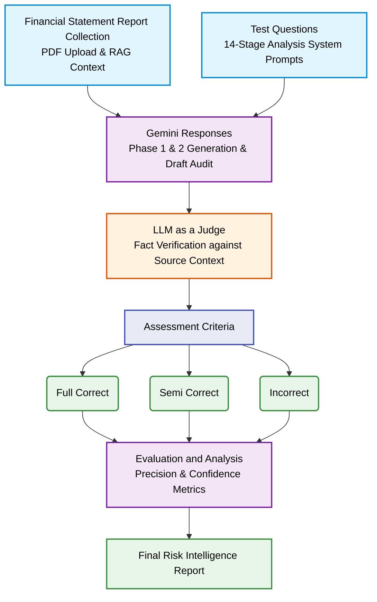

# Financial Statement Report Evaluation Flowchart

This document outlines the pipeline for the Financial Statement Report Evaluation, specifically detailing the integration of the "LLM as a Judge" for fact verification.

